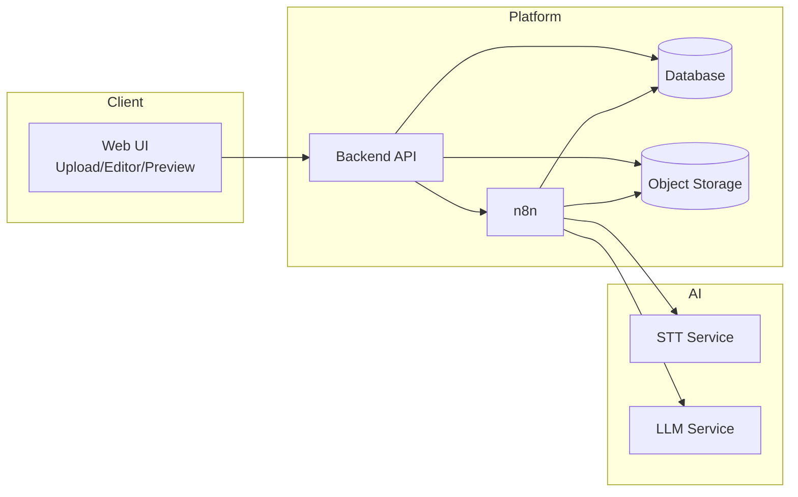
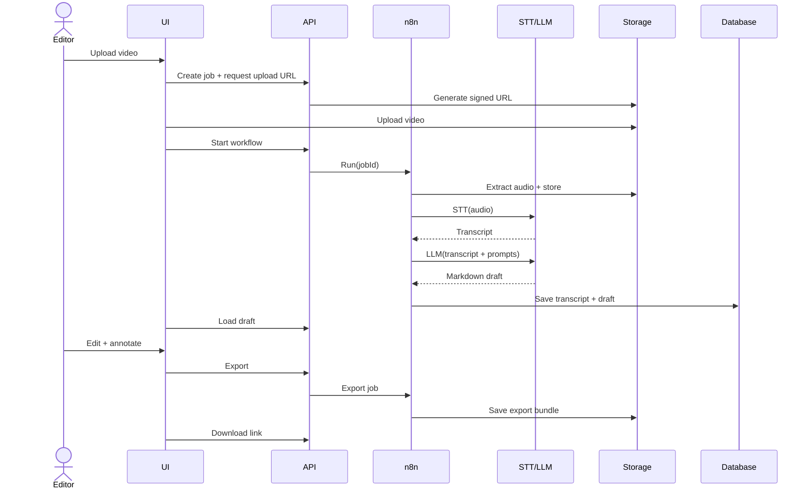
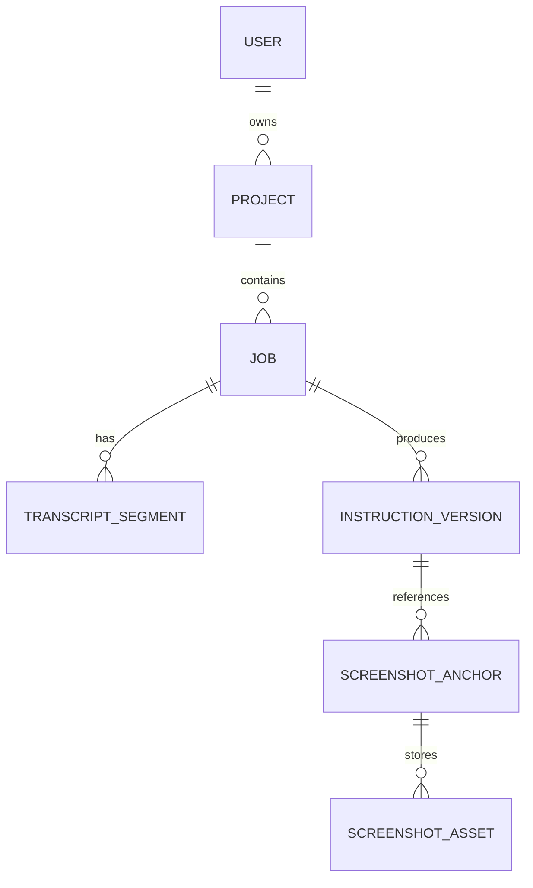

# Solution Architecture Specification (SAS)

## Product: Howera Web Service

## Version: 1.1

---

# Versioning & Delivery Phases

- **v1 – MVP (Cloud-First):** Firebase + OpenAI API
- **v2 – Hybrid:** Firebase + Local LLM (via OpenWebUI / LMStudio), with optional OpenAI fallback enabled only by environment/pipeline config
- **v3 – Full On-Prem:** Keycloak + PostgreSQL + MinIO + Local LLM + self-hosted orchestration

---

# 1. Executive Summary

## 1.1 Solution Overview

Howera is a web-based AI-powered platform that converts instructional or demo videos into structured, step-by-step documentation in Markdown format. The platform supports timestamp-based screenshot extraction, image annotation, preview rendering, and export to PDF or Markdown.

The system combines automated AI processing (Speech-to-Text and LLM-based content generation) with a human-in-the-loop editing workflow to ensure accuracy, consistency, and production-grade documentation quality.

---

## 1.2 Business Context

Organizations (Support, Business Analysis, Implementation, and Training teams) invest significant effort in manually transforming demo videos into structured documentation. This process is time-consuming, inconsistent, and difficult to scale.

Howera addresses this problem by:

- Reducing documentation time by an estimated 60–80%
- Standardizing documentation structure and formatting
- Enabling scalable AI-assisted documentation workflows
- Supporting hybrid and fully on-prem deployments for sensitive environments

---

## 1.3 Architectural Approach

Howera follows a workflow-driven architecture orchestrated by n8n:

`Upload → Audio Extraction → STT → LLM Generation → Human Editing → Export`

Key principles:

- Provider abstraction (OpenAI and Local LLM are interchangeable)
- Asynchronous processing for compute-intensive stages
- Deterministic, structured output (step-based format with timestamps)
- Progressive evolution from Cloud MVP to fully air-gapped On-Prem deployment

---

## 1.4 Key Constraints

- Must support fully air-gapped deployment (v3)
- Must allow local LLM and local STT execution (v2/v3)
- Must handle large file uploads (configurable limits)
- Must produce deterministic structured output (step hierarchy, timestamps, repeatability)
- Must support sensitive data handling (blur tools, annotations, audit logging)

---

## 1.5 High-Level Architecture Diagram

```mermaid
flowchart LR
  U[User] --> FE[Web UI: Upload + Editor + Preview]
  FE --> AUTH[Authentication]
  FE --> API[Backend API]
  FE --> STG[Object Storage: Video/Audio/Images]
  API --> WF[n8n Workflow Engine]
  WF --> AUD[Audio Extraction (FFmpeg)]
  WF --> STT[Speech-to-Text]
  WF --> LLM[LLM Instruction Generation]
  WF --> DB[(Metadata Database)]
  FE <-->|Read/Write| DB
  FE <-->|Media Access| STG

  STT -->|Transcript| DB
  LLM -->|Markdown Steps| DB
```

---

# 2. Scope & Assumptions

## 2.1 In Scope

- User authentication with a single application role (`editor`)
- Video upload, job creation, and progress tracking
- Audio extraction
- Speech-to-text transcription
- LLM-based instruction generation
- Markdown editor
- Timestamp-based screenshot extraction with frame navigation (± offset)
- Screenshot editing (blur, arrow, marker, pencil)
- Partial text regeneration via LLM
- Preview and export (PDF / .md)

---

## 2.2 Out of Scope (Initial Phases)

- Advanced RAG chatbot over documentation base
- Built-in multi-language processing pipeline
- Automated UI element detection via computer vision
- Full enterprise document approval workflow

---

## 2.3 Technical Assumptions

1. Supported video formats: MP4/MOV (H.264/H.265), normalized on ingestion.
2. STT returns timestamped transcript segments (start/end).
3. LLM supports structured Markdown output.
4. n8n has access to compute resources for FFmpeg and STT/LLM endpoints.
5. Model provider selection is global per environment (backend/pipeline config), not user-configurable in UI.

---

## 2.4 Dependencies

1. **v1:** Firebase (Auth/DB/Storage/Hosting) + OpenAI API
2. **v2:** Local LLM (OpenWebUI / LMStudio), optional local STT
3. **v3:** Keycloak + PostgreSQL + MinIO + Docker/Kubernetes + Local LLM serving + Local STT

---

## 2.5 Known Constraints

- Cloud cost variability in v1
- GPU infrastructure requirements in v2/v3
- Regulatory compliance depends on deployment model

---

# 3. Functional Overview

## 3.1 Primary Use Cases

1. Sign in / Sign out
2. Upload video and create a job
3. Run processing workflow (automatic or manual trigger)
4. View transcript (read-only; optional editing in v2+)
5. Generate instruction draft (Markdown)
6. Edit instruction content
7. Insert screenshot at timestamp
8. Adjust screenshot frame (± offset), replace/delete/upload from file
9. Annotate screenshot (blur/marker/arrow/pencil)
10. Regenerate selected text via LLM
11. Preview final document
12. Export to PDF or Markdown (including assets)

---

## 3.2 System Context Diagram

```mermaid
flowchart TB
  User((User)) --> Howera[Howera Platform]

  Howera --> LLMProvider[LLM Provider (OpenAI / Local)]
  Howera --> STTProvider[STT Provider (Whisper API / Local)]
  Howera --> Storage[Object Storage]
  Howera --> AuthProvider[Authentication Provider]
```

---

# 4. Architecture Overview

## 4.1 Architectural Style

- Modular Monolith (v1/v2)
- Asynchronous workflow processing
- Containerized On-Prem architecture (v3)

---

## 4.2 C4 Level 1–2 (Simplified)



---

# 5. Logical Architecture

## 5.1 Core Components

- **Web UI**
  - Upload page
  - Job status page
  - Markdown editor
  - Screenshot picker and annotation canvas
  - Preview and export
- **Backend API**
  - Authentication/session validation
  - Job CRUD
  - Signed upload/download URLs
  - Export generation trigger
  - Read global model configuration (per environment)
- **Workflow Orchestrator (n8n)**
  - Pipeline execution and retries
  - Status transitions
  - Artifact persistence (audio, transcript, markdown)
- **AI Providers**
  - STT service (OpenAI Whisper API or local Whisper)
  - LLM service (OpenAI or local LLM via OpenWebUI/LMStudio)
- **Storage**
  - Videos
  - Audio files
  - Screenshots (raw and annotated)
  - Export artifacts (PDF/Markdown bundles)
- **Metadata Store**
  - Projects, Jobs, Transcript segments, Instruction versions, Screenshot anchors

### 5.2 Logical Contracts

- **API ↔ Workflow**
  - `POST /jobs/{id}/run`
  - `POST /internal/jobs/{id}/status`
- **Workflow ↔ STT**
  - `POST /stt/transcribe` → transcript segments
- **Workflow ↔ LLM**
  - `POST /llm/generate` → markdown
  - `POST /llm/regenerate` → markdown fragment
- **API ↔ Storage**
  - Signed URLs for upload/download

### 5.3 Domain Boundaries

- Identity & Access
- Job Processing
- Content Authoring
- Media Assets
- Export Management

---

# 6. Workflow Diagrams

## Business Workflow



---

## Job States

- CREATED
- UPLOADING
- UPLOADED
- AUDIO_EXTRACTING
- AUDIO_READY
- TRANSCRIBING
- TRANSCRIPT_READY
- GENERATING
- DRAFT\_READY
- EDITING
- REGENERATING
- EXPORTING
- DONE
- FAILED
- CANCELLED

---

# 7. Data Architecture

## 7.1 Data Sources

- Uploaded video file
- Global model provider configuration (environment/pipeline)
- Prompt templates
- User edits (Markdown + screenshot operations)

## 7.2 Data Outputs

- Transcript segments
- Instruction versions
- Screenshot assets
- Export artifacts

## 7.3 Transformation Logic

- Video → Audio (FFmpeg)
- Audio → Transcript (STT)
- Transcript + prompts → Markdown steps (LLM)
- Timestamp → Frame extraction → Image file
- Image → Annotated image (client-side canvas or server-side rendering)

## 7.4 Storage Model

- Immutable raw artifacts (video/audio/transcript snapshots)
- Versioned instruction entities (`instruction_versions`)
- Derived screenshot assets per anchor

## 7.5 Retention Policy (Configurable)

- Raw videos: 30–180 days
- Transcripts/instructions: 1–3 years
- Exports: 90 days
- Audit logs: ≥ 1 year

---

# 8. Data Model

## 8.1 Conceptual ER



## 8.2 Core Tables

- users
- projects
- jobs
- transcript\_segments
- instruction\_versions
- screenshot\_anchors
- screenshot\_assets
- model\_configs
- audit\_log

## 8.3 Indexing Examples

- `jobs(project_id, created_at)`
- `transcript_segments(job_id, start_ms)`
- `instruction_versions(job_id, version DESC)`
- `screenshot_anchors(instruction_version_id, anchor_pos)`

## 8.4 Consistency Strategy

- v1 (Firestore): eventual consistency acceptable for UI interactions
- v3 (PostgreSQL): ACID compliance for metadata; object storage remains eventually consistent

---

# 9. Integration Architecture

## 9.1 External Systems

- OpenAI API (v1; optional in v2 via environment/pipeline config)
- Local LLM endpoint (v2/v3; selected via environment/pipeline config)
- STT endpoint (cloud or local)

## 9.2 API Contracts (High-Level)

- Authoritative path list: `spec/api/openapi.yaml`
- `POST /projects`, `GET /projects`, `GET /projects/{projectId}`
- `POST /projects/{projectId}/jobs`, `GET /jobs/{jobId}`, `POST /jobs/{jobId}/confirm-upload`
- `POST /jobs/{jobId}/run`, `POST /jobs/{jobId}/cancel`, `POST /jobs/{jobId}/retry`
- `GET /jobs/{jobId}/transcript`
- `GET /instructions/{instructionId}`, `PUT /instructions/{instructionId}`
- `POST /instructions/{instructionId}/regenerate`, `GET /tasks/{taskId}`
- `POST /jobs/{jobId}/screenshots/extract`, `GET /screenshot-tasks/{taskId}`
- `POST /instructions/{instructionId}/anchors`, `GET /instructions/{instructionId}/anchors`, `GET /anchors/{anchorId}`
- `POST /anchors/{anchorId}/replace`, `DELETE /anchors/{anchorId}/assets/{assetId}`
- `POST /jobs/{jobId}/screenshots/uploads`, `POST /jobs/{jobId}/screenshots/uploads/{uploadId}/confirm`, `POST /anchors/{anchorId}/attach-upload`
- `POST /anchors/{anchorId}/annotations`
- `POST /jobs/{jobId}/exports`, `GET /exports/{exportId}`
- `POST /internal/jobs/{jobId}/status`

## 9.3 Authentication

- v1/v2: Firebase JWT validation (`editor` role)
- v3: Keycloak OIDC validation (`editor` role in app context)

## 9.4 Retry Strategy

- Bounded retries with exponential backoff
- Idempotent export operations

---

# 10. Technology Stack

## 10.1 v1 – MVP

- React/Vite (Firebase Hosting)
- Firebase Auth
- Firestore
- Firebase Storage
- n8n
- OpenAI STT
- OpenAI LLM
- Server-side export service

**Trade-offs:**

- Fast time-to-market
- Minimal DevOps overhead
- Vendor lock-in and cloud dependency

---

## 10.2 v2 – Hybrid

- Firebase core services
- Local LLM endpoint (primary)
- Optional local STT
- Optional OpenAI fallback controlled by environment/pipeline config

**Trade-offs:**

- Reduced inference cost
- Improved data control
- Cloud dependency remains

---

## 10.3 v3 – On-Prem

- Nginx / Traefik
- Keycloak
- PostgreSQL
- MinIO
- Self-hosted n8n
- vLLM / Ollama / TGI
- Faster-Whisper
- Docker / Kubernetes

**Trade-offs:**

- Full control and air-gapped readiness
- Higher operational complexity

---

# 11. Security Architecture

- Authenticated access with a single application role (`editor`)
- TLS encryption in transit
- Encryption at rest
- Centralized secrets management
- Audit logging

Primary threats:

- Data leakage
- Prompt injection
- Unauthorized access

---

# 12. Non-Functional Requirements

Performance target:

- Draft generation under 10 minutes for a 60-minute video (GPU dependent)

Availability targets:

- v1: ≥ 99.5%
- v3: ≥ 99.9%

Scalability:

- Horizontal scaling of workers and model serving

Backup:

- Daily database backups
- Storage lifecycle policies

---

# 13. Deployment Architecture

## 13.1 Phase Topology

- v1: Firebase-hosted frontend + n8n + OpenAI
- v2: Firebase + n8n + local model host
- v3: On-prem cluster (API + FE + n8n + workers + DB + MinIO + model serving)

## 13.2 Environments

- dev
- stage
- prod

## 13.3 CI/CD

- Automated frontend build and deployment
- Containerized backend builds
- Infrastructure as Code (Terraform/Ansible/Helm)

## 13.4 Orchestration

- Docker Compose (MVP)
- Kubernetes (Enterprise)

## 13.5 On-Prem Considerations

- Offline container registry
- Controlled update procedures
- GPU driver and CUDA compatibility management

---

# 14. Testing Strategy

1. Unit testing
2. Integration testing
3. Contract testing (LLM/STT adapters)
4. Load testing
5. Security testing (SAST/DAST, auth/session validation)

---

# 15. Risks & Trade-Offs

Key risks:

- Vendor lock-in (v1)
- Cloud cost spikes
- LLM output variability
- GPU capacity bottlenecks

Mitigation strategies:

- Provider abstraction
- Schema validation for LLM output
- Rate limiting and quotas
- Horizontal scaling

---

# 16. Observability & Monitoring

Metrics:

- Job duration per stage
- Success/failure rates
- Token usage (v1)
- GPU utilization (v2/v3)

Logging:

- Structured logs with correlation IDs

Alerting:

- Error rate thresholds
- Queue backlog alerts
- Storage capacity alerts
- Model endpoint availability alerts

---

# 17. Future Evolution

Scaling roadmap:

- Worker autoscaling
- Multi-tenant isolation
- Incremental transcript regeneration

Extension points:

- RAG-based knowledge layer
- Template libraries per domain
- Multi-language expansion

---

# Implementation Phases Summary

## v1 – MVP (Priority)

Core AI workflow + editor + export

## v2 – Hybrid

Local model integration with global provider configuration

## v3 – On-Prem

Full infrastructure replacement + hardened enterprise security
